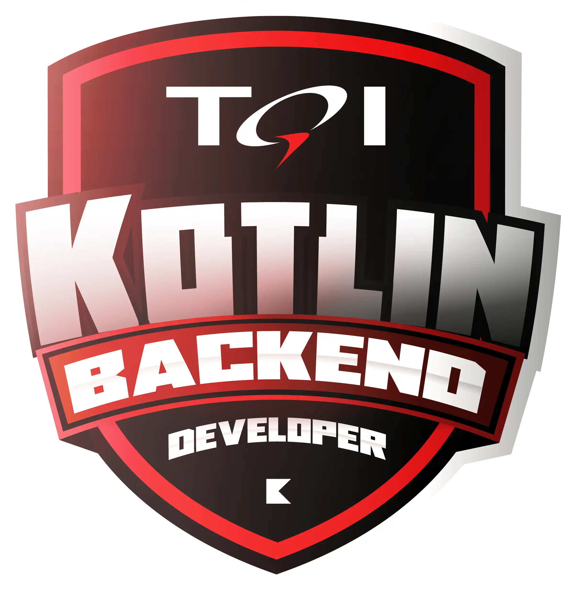

<h1>

Bootcamp TQI Kotlin - Backend Developer </h1>

<h3> Andamento do Processo:</h3>

## #1 Princípios de Agilidade e Desenvolvimento de Software

  - [x] Conheça as Oportunidades da DIO
  - [x] Seja Protagonista Neste Bootcamp  
  - [x] Boas-vindas ao Bootcamp TQI Kotlin - Backend Developer
  - [x] Introdução ao Desenvolvimento Moderno de Software
  - [x] Trabalhando em Equipes Ágeis 
  - [x] Introdução à Programação e Pensamento Computacional  
  - [x]	Como Entregar seu Desafio de Projeto	
  - [x] Criando seu Primeiro Repositório no GitHub Para Compartilhar Seu Progresso
  - [x] TQI Kotlin Backend Developer I Aula Inaugural

   

## #2 Docker Fundamentals

  - [x] Introdução e Laboratório Virtual
  - [x] Primeiros Passos com o Docker
  - [x] Armazenamento de Dados com Docker
  - [x] Processamento, Logs e Rede com Docker
  - [x] Definição e Criação de um Docker File
  - [x] Docker Compose
  - [x] Criando um Container de uma Aplicação WEB

   

## #3 Dominando a Linguagem de Programação Java    ****

  - [x] Ambiente de Desenvolvimento Java
  - [x] Aprendendo a Sintaxe Java
  - [x] Lógica Condicional e Controle de Fluxos em Java
  - [x] Estruturas de Repetição e Arrays em Java
  - [x] Entendendo Métodos Java
  - [x] Programação Orientada a Objetos com Java
  - [x] Trabalhando com Collections Java
  - [x] Debuging Java
  - [x] Tratamento de Exceções em Java
  - [x] Abstraindo um Bootcamp Usando Orientação a Objetos em Java

     

## #4 Refinando Sua Técnica Com Desafios de Código em Java

  - [x] Desafio comJava: Tráfego de Trânsito
  - [x] Desafio com Java: Compras na Livraria
  - [x] Desafio com Java: Idade Planetária
  - [x] Desafio com Java: Gerenciamento de Loja Geek
  - [x] Desafio com Java: Mudança para Irlanda

     

## #5 Dominando a Linguagem de Programação Kotlin

   - [x] Conhecendo o Kotlin e Sua Documentação Oficial
   - [x] Introdução Prática à Linguagem de Programação Kotlin
   - [x] Estruturas de Controle de Fluxo e Coleções em Kotlin
   - [x] Orientação a Objetos e Tipos de Classes na Prática com Kotlin
   - [x] O Poder das Funções em Kotlin
   - [x] Tratamento de Exceções em Kotlin
   - [x] Abstraindo Formações da DIO Usando Orientação a Objetos com Kotlin  **

       

## #6 Refinando Sua Técnica Com Desafios de Código em Kotli

  - [x] Desafio com Kotlin: Média Final do Aluno
  - [x] Desafio com Kotlin: Data por Extenso
  - [x] Desafio com Kotlin: Numeral Romano
  - [x] Desafio com Kotlin: Cálculo Salarial
  - [x] Desafio com Kotlin: Taxa de Crescimento

       

## #7 Primeiros Passos com SQL

  - [x] MySQL - Trabalhando com suas Primeiras Tabelas
  - [x] MySQL - Explorando Relacionamentos com MySQL Workbench
  - [x] MySQL - Consultas com Join
 
       

## #8 Explorando o Spring Framework comJava e Kotlin	

  - [x] Principais Protocolos de Comunicação da Internet
  - [x] Projetos Java com Gradle
  - [x] Testes Unitários Com JUnit
  - [x] Contextualizando o Desenvolvimento Web com Spring Boot 3 e Kotlin
  - [x] Criando uma Api Rest com Kotlin e Persistência de Dados
  - [x] Adicionando Segurança a uma API REST com Spring Security 
  - [x] Explorando Padrões de Projetos na Prática com Java
  - [x] Documentando e Testando sua API Rest com Kotlin
  - [x] Avalie este Bootcamp

       

  

### _#BootcampTQIKotlin_

### _#ContratoDeCompromisso_

   

